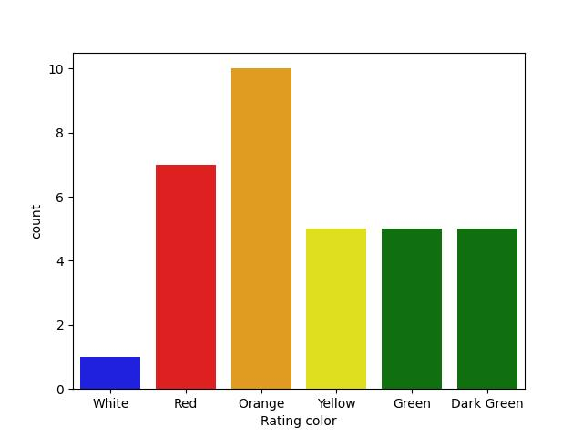

# Zomato_analysis_Using-Python
## Objective
To findout most zomato platform using countries and Analyze the rating of them based on their experiance using python.
### Top three countries using the Zomato 

### City Wise Distribution

## Based on the data Observations the rating can be classified into these groups
### Observations
1. When Rating is between 4.5 to 4.9 —-> Excellent
2. When Rating are between 4.0 to 4.4—> very good
3. when Rating is between 3.5 to 3.9 —-> good
4. when Rating is between 3.0 to 3.4 —-> average
5. when Rating is between 2.5 to 2.9 —-> average
6. when Rating is between 2.0 to 2 4 —-> Poor

## Aggregate rating Vs Rating Count

### Observation:
1. Highest number of people has given 0 rating.
2. The average rating is in between 2.5-3.4.

### Rating Color Vs Rating Count

## Observations
1. Top 5 cities are from india
2. Maximum nuber of transactions were taking places in New Delhi.
3. Online deliveries were avaliable in the India and UAE.
4. india holds the highest 0 ratings
5. Highest number of people has given 0 rating.
6. The average rating is in between 2.5-3.4.
1. When Rating is between 4.5 to 4.9 —-> Excellent
2. When Rating are between 4.0 to 4.4—> very good
3. when Rating is between 3.5 to 3.9 —-> good
4. when Rating is between 3.0 to 3.4 —-> average
5. when Rating is between 2.5 to 2.9 —-> average
6. when Rating is between 2.0 to 2 4 —-> Poor
7. Observation: Zomato maximum records or transactions are from India After that USA and
then United Kingdom.

